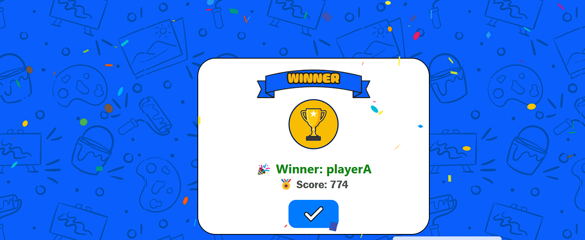

# 🎮 DoodleDash - Real-Time Multiplayer Drawing & Guessing Game

DoodleDash is an engaging, real-time multiplayer game where players draw a word while others guess it — similar to Pictionary. It supports custom room creation, real-time drawing synchronization, in-room chat, animated timer bar, and ranks the players based on their performance.

---

## 🔥 Features

- 🎨 **Live Drawing Canvas** — Draw and broadcast in real-time across players.
- ⌛ **Timer Bar** — Visually shrinking, animated timer with color transition from green to red.
- 👥 **Room-Based Multiplayer** — Create or join private rooms using unique room IDs.
- 💬 **In-Game Chat** — Type and chat while you guess the drawings.
- 🧠 **Smart Word System** — Words vary in difficulty: Easy, Medium, Hard, Very Hard.
- 🏆 **Winner Page** — Final screen showing scores and winners.
- 🌐 **Cross-Device Support** — Works across different devices with internet access.
- ⚡ **Fast Performance** — Faster response and synchronization than similar online games.
- 🎯 **Clean & Minimal UI** — Smooth animations with Framer Motion and responsive design.

---

## 🚀 How to Use the Game (as a user)

1. **Visit the Homepage**
   - You’ll see two sections: **Create Room** and **Join Room**

2. **To Create a Room:**
   - Enter your **name**.
   - Click the **Generate** button to create a unique room ID.
   - Click **Copy** to share the room ID.
   - Others can use this room ID to join your game.

3. **To Join a Room:**
   - Enter your **nickname**.
   - Paste the **room ID** shared by the host.
   - Click on **Play!**

4. **Gameplay:**
   - One player is chosen as the drawer, others try to guess the word.
   - Timer and chat run in real-time.
   - Points are awarded for correct guesses.
   - Winner is shown at the end based on score.

---

## 📸 Screenshots

### 🎨 Game Board


### 🏆 Winner Page


### 🗨️Chat Section


### ℹ️Rule Page


---

## 🛠 Tech Stack

- **Frontend:** React.js, HTML5 Canvas, CSS, Framer Motion, React Icons
- **Backend:** Node.js, Express.js, Socket.IO

---

## 📦 Running the Project Locally

### Backend
```bash
cd backend
npm install
node index.js
